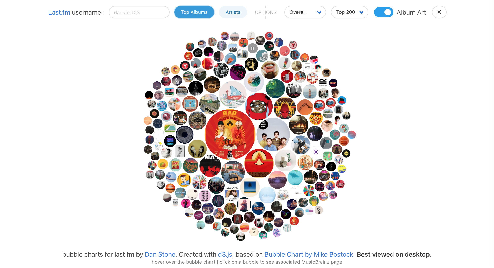

# Bubble Charts for Last.fm

This visualisation contains two classes:

* bubblechart.js: Reusable component that renders a bubble chart.
* lastfm.js: A class to get an example data set from Last.fm.

To use the visualisation, enter a username into the username field and click **'Top Albums'**. Some example usernames:

* danster103 (me)
* thomaspepall
* nicholasfl

Please wait for the data to load. If an error is returned, an example will be loaded from example.js. Try again as sometimes this can be a temporary issue with the last.fm API.

You should see a visualisation that looks like this. Bigger circles represent albums that I have streamed more over the last couple years. 



### Getting started

Import the `bubblechart.js` script and create a new BubbleChart instance by passing in the svg element that you would like the bubble chart to be rendered in.

```javascript
chart = new BubbleChart('svg');
```

Optionally, you can pass in an object with parameters that you would like to customise. 
```javascript
chart = new BubbleChart('svg', options);
```

The options object can contain any of the following properties (by default)
```javascript
{
    width: 600,
    height: 600,
    albumArtEnabled: true,
    mouseoverOpacity: 0.3,
    power: 1,
    descriptor: {
        name: 'Album',
        value: 'Playcount'
    }
};
```

### Descriptors

The descriptors can be set in the constructor, or with the setter. They define the messages that appear before the values in the title element of each bubble. This is visible on mouse hover. In the example, when Top Artists or Top Albums is clicked, the descriptor is changed as follows.

```javascript
chart.descriptor = {
    name: (dataType === 'albums' ? 'Album' : 'Artist'),
    value: 'Playcount'
};
```

### Click Handlers

If you would like to perform an action on the chart click, you can set a click handler on the chart object. This needs to be in the form of a function with one parameter, `data`. When a bubble on the chart is clicked, and a click handler has been defined, the data object associated with the selected bubble is passed to the click handler. This can be used to display a pop-up or redirect to a website with more information. An example click handler:

```javascript
function (data) {
    if (data.id && !data.id.startsWith('!')) {
        window.open(
            `https://musicbrainz.org/${data.type}/${data.id}`, '_blank');
    } else {
        alert('No associated MusicBrainz ID for this bubble.');
    }
};
```

### Documentation

Generate documentation with `npm run generate-docs`.

### License

Originally based on the d3 bubble chart visualisation here: [https://observablehq.com/@d3/bubble-chart](https://observablehq.com/@d3/bubble-chart)

I adapted the code to work in a normal browser, without Observable libraries. There is no direct license on the ObservableHQ page, and therefore the above attribution will have to do.

The dataset I have chosen is the [last.fm API](https://www.last.fm/api/intro). It's terms of service can be found at the following address [https://www.last.fm/api/tos](https://www.last.fm/api/tos).

```
Bubble Charts for Last.fm
Copyright (C) 2020

This program is free software: you can redistribute it and/or modify
it under the terms of the GNU General Public License as published by
the Free Software Foundation, either version 3 of the License, or
(at your option) any later version.

This program is distributed in the hope that it will be useful,
but WITHOUT ANY WARRANTY; without even the implied warranty of
MERCHANTABILITY or FITNESS FOR A PARTICULAR PURPOSE.  See the
GNU General Public License for more details.

You should have received a copy of the GNU General Public License
along with this program.  If not, see <https://www.gnu.org/licenses/>.
```
